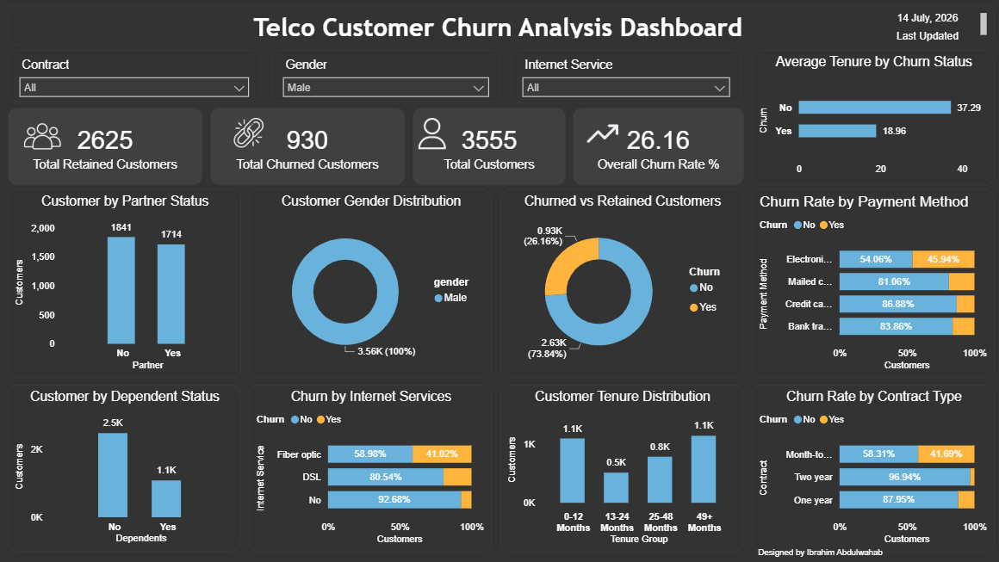

# 📞 Telco Customer Churn Analytics

## 📌 Project Overview

This project analyzes customer churn patterns in a telecommunications company using Microsoft Power BI. The dashboard provides insights into customer retention, churn behavior, contract types, payment methods, internet services, and customer demographics to support data-driven customer retention strategies.

---

## 🎯 Business Objectives

This analysis answers the following business questions:

- What is the overall customer churn rate?
- How many customers were retained versus churned?
- Which contract types have the highest churn?
- Which payment methods are associated with higher churn?
- How does internet service influence customer churn?
- Does customer tenure affect churn?
- Are there demographic differences between retained and churned customers?

---

## 📂 Repository Structure

```text
Telco-Customer-Churn-Analytics
│
├── Dashboard
│   ├── Telco_Customer_Churn_Dashboard.pbix
│   └── Dashboard.png
│
├── Data
│   └── Telco_Customer_Churn.csv
│
└── README.md
```

---

## 📂 Dataset

The dataset contains customer information including:

- Customer ID
- Gender
- Partner Status
- Dependents
- Internet Service
- Contract Type
- Payment Method
- Monthly Charges
- Total Charges
- Customer Tenure
- Churn Status

---

## 🛠️ Tools Used

- Microsoft Power BI
- Power Query
- DAX
- Data Modeling
- Interactive Dashboard Design

---

## 📊 Dashboard Preview



---

## 💡 Key Insights

- 📉 The overall customer churn rate is **26.54%**, with approximately **2,000 customers** leaving out of **7,043 total customers**.
- 📄 Customers on **Month-to-Month contracts** experienced the highest churn, while **Two-Year contracts** had the strongest customer retention.
- 🌐 Customers using **Fiber Optic internet service** showed a significantly higher churn rate compared to DSL and customers without internet service.
- 💳 Customers paying through **Electronic Check** had the highest churn rate among all payment methods.
- ⏳ Customers with **0–12 months of tenure** represented the largest customer group, indicating that retaining new customers is critical.
- 👥 The customer base was **almost evenly split between male and female customers**, suggesting gender had little impact on churn.
- 🤝 Most customers **did not have dependents**, while partner status was relatively balanced across the customer base.
- 📊 Retained customers had an **average tenure of 37.57 months**, compared to **17.98 months** for churned customers, showing that longer-tenured customers are much more likely to stay.

---

## 💼 Business Recommendations

- Encourage customers to switch from **Month-to-Month contracts** to **One-Year or Two-Year plans** through loyalty discounts and promotional offers.
- Investigate the causes of higher churn among **Fiber Optic customers** and improve service quality and customer support.
- Develop targeted retention campaigns for customers using **Electronic Check** as their payment method.
- Strengthen onboarding and engagement programs for customers within their **first 12 months**, where churn risk is highest.
- Reward long-term customers with exclusive benefits and personalized offers to further improve retention.
- Monitor churn trends regularly using interactive dashboards to support proactive customer retention strategies.

---

## 🚀 Skills Demonstrated

- Data Cleaning
- Data Modeling
- DAX
- Power BI
- Interactive Dashboard Design
- Data Visualization
- Business Intelligence

---

## 👤 Author

**Ibrahim Abdulwahab**

  Data Analyst
